<div align="center">



</div>


<br/>

<div align="center">

[](https://hassanraz-a.github.io/portfolio-/)&nbsp;&nbsp;
[](https://www.linkedin.com/in/hassan-raza-212680202/)&nbsp;&nbsp;
[](https://github.com/HassanRaz-A)

</div>

<br/>


<br/>

## `> whoami`

```typescript
const engineer = {
  name: "Hassan Raza",
  role: "RF & Wireless Network Engineer",
  focus: "DAS Design · Optimization · Python Automation",

  rf: ["DAS Design", "iBwave", "5G / LTE", "In-Building Coverage", "Drive Testing"],
  analysis: ["TEMS Investigation", "Gladiator", "Wireshark", "KPI Post-Processing"],
  automation: ["Python", "Pandas", "NumPy", "Plotly", "Bash"],
  ml: ["TensorFlow", "PyTorch", "scikit-learn", "Anomaly Detection"],

  currentlyBuilding:
    "Python automation & ML models for wireless network optimization",
  openTo: ["Collaboration", "Telecom / RF projects", "Wireless + AI research"],

  philosophy: [
    "Let the drive-test data decide, not assumptions",
    "Automate the repetitive, focus on the exceptions",
    "Bridge classical RF engineering with modern data science",
  ],
} as const;
```

<br/>


## `> engineering-principles`

<table>
<tr>
<td width="50%" valign="top">

**`[ RF Design ]`**

- Coverage and capacity planned together
- iBwave modeling grounded in real link budgets
- Interference mitigation by design, not patch
- Topology and assumptions documented up front

</td>
<td width="50%" valign="top">

**`[ Optimization ]`**

- Data-driven tuning from drive-test KPIs
- Minimize dropped calls, maximize throughput
- Validate changes against measured results
- Repeatable, reviewable optimization workflows

</td>
</tr>
<tr>
<td width="50%" valign="top">

**`[ Automation ]`**

- Turn manual KPI analysis into scripts
- Parse logs and generate reports in minutes
- Version-controlled, reproducible pipelines
- Clear visualizations over raw log dumps

</td>
<td width="50%" valign="top">

**`[ Data & ML ]`**

- Clean, trustworthy data before modeling
- Anomaly detection on RF KPIs
- Signal prediction and intelligent planning
- Practical models that inform real decisions

</td>
</tr>
</table>

<br/>


## `> core-stack`

<div align="center">

#### Languages


#### Data &amp; Machine Learning


#### Web &amp; APIs


#### Cloud &amp; Infrastructure


#### RF &amp; Wireless Toolkit


</div>

<br/>


## `> current-focus`

```sh
$ hassan status --verbose

[✓] Optimizing  → DAS coverage & capacity with iBwave
[✓] Analyzing   → Drive-test KPIs (TEMS, Gladiator, Wireshark)
[✓] Automating  → RF post-processing pipelines in Python
[✓] Exploring   → AI/ML for signal prediction & anomaly detection
[~] Next        → Intelligent, data-driven coverage planning

uptime: reliable networks · faster analysis · smarter optimization
```

<br/>


## `> how-i-drive-impact`

<div align="center">

<table>
<tr>
<td width="50%" valign="top">

### 📡 RF Network Optimization

`iBwave` `DAS` `5G / LTE`

> Designed and optimized Distributed Antenna Systems for in-building and venue coverage — improving signal quality and reducing dropped-call rates across enterprise deployments.

</td>
<td width="50%" valign="top">

### 📊 KPI Analysis & Drive Testing

`TEMS` `Gladiator` `Wireshark`

> Conducted RF post-processing on drive-test logs, turning raw measurements into actionable insights for network planning teams.

</td>
</tr>
<tr>
<td width="50%" valign="top">

### 🐍 Python Automation

`Pandas` `NumPy` `Plotly`

> Built automation that cut hours of manual KPI analysis down to minutes — parsing logs, generating reports, and visualizing wireless performance data.

</td>
<td width="50%" valign="top">

### 🤖 AI/ML for Wireless

`TensorFlow` `PyTorch` `scikit-learn`

> Exploring ML models for signal prediction, anomaly detection in RF KPIs, and intelligent coverage planning — bridging RF engineering with data science.

</td>
</tr>
</table>

</div>

<br/>


## `> metrics-dashboard`

<div align="center">


</div>

<br/>

### Contribution Snake

<div align="center">


</div>

<br/>

### Contribution Activity

<div align="center">


</div>

<br/>

### Analytics

<div align="center">


</div>

<br/>


## `> areas-of-focus`

<div align="center">

I keep wireless networks reliable, well-optimized, and increasingly automated — pairing hands-on RF engineering with Python and machine learning to turn measurement data into better coverage.

**Open to:**
&nbsp;&nbsp;`RF optimization` &nbsp;·&nbsp; `DAS design` &nbsp;·&nbsp; `Network automation` &nbsp;·&nbsp; `Telecom data / AI` &nbsp;·&nbsp; `Collaboration`

</div>

<br/>


## `> connect`

<div align="center">

<a href="https://www.linkedin.com/in/hassan-raza-212680202/">
  
</a>
&nbsp;
<a href="https://hassanraz-a.github.io/portfolio-/">
  
</a>
&nbsp;
<a href="https://github.com/HassanRaz-A">
  
</a>

</div>

<br/>


<div align="center">

```
Engineering reliable wireless networks with precision, data, and automation.
```

<sub>
  <code>Metrics update automatically every 12h via GitHub Actions · Snake regenerates daily</code>
</sub>

</div>
